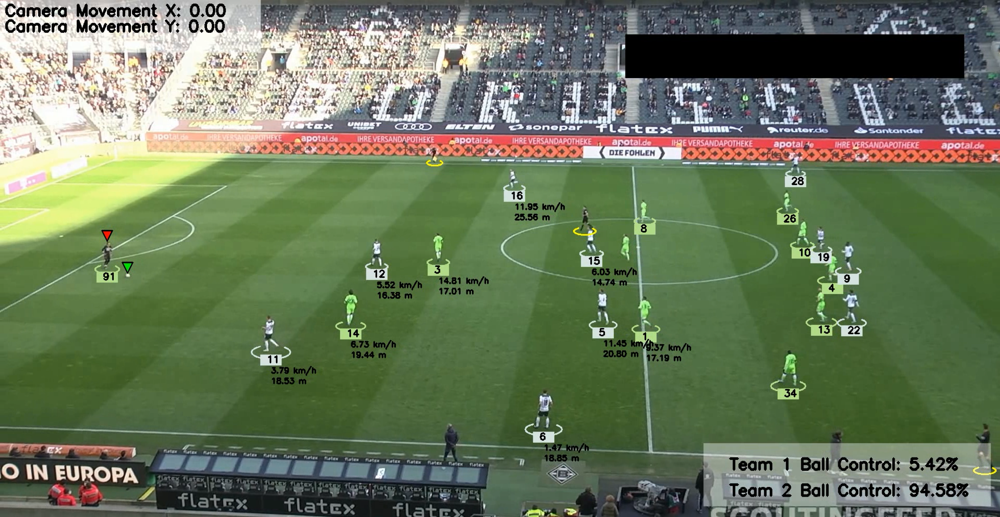
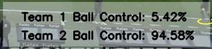

# Football Analysis

## Training
Please run the Jupyter Notebook in the training folder to get the best model and put it into the models folder.

## ⚽ Features
1. [Object Detection and Tracking](#object-detection-and-tracking)
2. [Player Club Assignment](#player-club-assignment)
3. [Ball Control](#ball-control)
4. [Camera Movement Estimator](#camera-movement-estimator)
5. [Perspective Transformation](#perspective-transformation)
6. [Speed Estimation](#speed-estimation)

### [Object Detection and Tracking](trackers/tracker.py)
Detect and track players, goalkeepers, referees, and footballs.
- YOLO: AI object detection model
- ByteTrack: Object Tracking

### [Player Club Assignment](team_assigner/team_assigner.py)
Kmeans: Pixel segmentation and clustering to detect t-shirt color
- Extract player colors using KMeans.
- Assign team colors by clustering players’ colors into two groups.
- Use the color assignment to classify players into one of two teams.

### [Ball Control](player_ball_assigner/player_ball_assigner.py)
Determine which player is closest to the ball based on their position in the frame by calculating the distance between each player's foot position (using their bounding box) and the ball's center.

### [Camera Movement Estimator](camera_movement_estimator/camera_movement_estimator.py)
Using Optical Flow to track the movement of the camera across video frames by analyzing the displacement of feature points between frames and adjusts object

### [Perspective Transformation](view_transformer/view_transformer.py)
Standardizing the area.

### [Speed Estimation](speed_and_distance_estimator/speed_and_distance_estimator.py)
- **Speed and Distance Calculation**: Measures the speed and total distance covered by tracked objects.
- **Frame Annotations**: Displays speed and distance on the video frames, making it easy to visualize the motion analysis.

### Known Issues
Below are some unresolved issues:
1. When a player leaves the frame for a few seconds, they may be assigned a different ID upon reappearing.
2. During player collisions, players may be assigned different IDs due to the confusion in tracking.
#### Future Solution
We plan to address these issues by replacing the current system with DEEPSORT for improved tracking accuracy.

